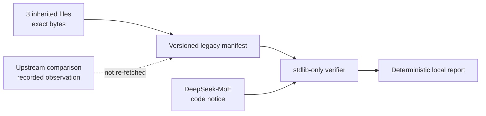

# LossTopology Lab

> **Rehabilitation status:** original CPU-only topology lab plus a provenance
> boundary. The inherited trainer is quarantined, not a supported entry point.
> This repository does not claim a successful training run, tokenizer result,
> model-quality result, perplexity value, or benchmark.

LossTopology Lab is being built as a CPU-runnable audit system for supervised
fine-tuning token boundaries and assistant-only loss masks. Its first task is
more fundamental: establish an honest, testable boundary around the repository
that existed before the new system.



## What exists today

| Area | Current state | Evidence |
|---|---|---|
| Legacy bytes | 3 files locked by mode, size, SHA-256, line count, and Git blob ID | `provenance/legacy-snapshot.v1.json` |
| Local semantic check | ZeRO-3 JSON normalized and re-hashed without third-party packages | `tools/verify_legacy_snapshot.py` |
| Attribution | DeepSeek-MoE credited; upstream MIT code notice retained locally | `THIRD_PARTY_NOTICES.md` |
| Drift tests | Byte changes, formatting-only changes, duplicate JSON keys, symlinks, and notice drift fail closed | `tests/test_legacy_attestation.py` |
| Synthetic trace contract | Strict v1 conversations, explicit token spans, immutable models, canonical identities | `docs/synthetic-trace-contract.md` |
| Loss topology engine | Deterministic all-token and assistant-only label construction plus boundary/run audits | `docs/loss-topology-audit.md` |
| Safe CLI | Bounded stdlib input and atomic canonical audit output | `python3 -m loss_topology.cli --help` |
| Models and data | Not downloaded, vendored, loaded, or attested | Explicit trust boundary |

The inherited files remain at their historical paths so this first change does
not rewrite their bytes or obscure repository history:

- `finetune.py`
- `configs/ds_config_zero3.json`
- `requirements.txt`

They are retained for provenance inspection only. Tests and verification never
import or execute `finetune.py`.

## Verify the snapshot

The complete verification path uses only the Python standard library:

```bash
python3 tools/verify_legacy_snapshot.py
python3 tools/verify_legacy_snapshot.py --json
python3 -m unittest discover -s tests -v
```

The verifier reads a bounded, strict JSON manifest; rejects duplicate keys,
unsafe paths, symlinks, missing files, and schema ambiguity; checks every
legacy byte identity; verifies the local third-party notice; and recomputes the
local semantic hash. It performs no network access and imports no ML stack.

## Audit a synthetic topology

The checked fixtures contain synthetic text and hand-authored token IDs. The
lab does not claim a real tokenizer produced them.

```bash
mkdir -p build
python3 -m loss_topology.cli \
  --input fixtures/synthetic/healthy.v1.json \
  --output build/healthy.audit.json
python3 -m json.tool build/healthy.audit.json
```

The output binds the validated input by canonical SHA-256, shows exact label
arrays and supervised runs for both policies, and counts boundary, padding,
off-policy, and missing-target positions. The deliberately empty assistant
fixture returns status 1 with a canonical failing report:

```bash
python3 -m loss_topology.cli \
  --input fixtures/synthetic/empty-assistant.v1.json \
  --output build/empty-assistant.audit.json
```

Contract violations return status 2 and do not replace an existing output.
See `docs/synthetic-trace-contract.md` and `docs/loss-topology-audit.md` for the
limits and exact trust boundary.

## Provenance and license boundary

A review found that 185 of the 230 local trainer lines participate in an exact
line longest-common-subsequence comparison with the official
[DeepSeek-MoE `finetune.py`](https://github.com/deepseek-ai/DeepSeek-MoE/blob/66edeee5a4f75cbd76e0316229ad101805a90e01/finetune/finetune.py).
The local ZeRO-3 configuration and the corresponding upstream configuration
produced the same sorted, compact semantic JSON SHA-256:
`ac305ab8aba093eb0a29f94629baf3c89ca266077f1246ae89a42b3648aaf23e`.

Those are recorded cross-repository audit observations against immutable
upstream revision
[`66edeee5`](https://github.com/deepseek-ai/DeepSeek-MoE/tree/66edeee5a4f75cbd76e0316229ad101805a90e01).
The manifest pins the exact upstream Git blob IDs and byte lengths. The
upstream bytes are not copied into the attestation fixture, so the offline
verifier does not claim to rerun that comparison; it proves the local files
are still the files that were compared.

DeepSeek-MoE publishes its code under its
[MIT `LICENSE-CODE`](https://github.com/deepseek-ai/DeepSeek-MoE/blob/66edeee5a4f75cbd76e0316229ad101805a90e01/LICENSE-CODE).
The retained notice is scoped to inherited DeepSeek-derived code. There is no
repository-wide license declaration in this foundation slice.

Code terms do not grant model or dataset rights. A future adapter must
separately pin and document every model, tokenizer, dataset, checkpoint,
revision, checksum, and applicable license before it can enter a reproducible
workflow.

## Scope and next work

All new lab code lives outside the inherited trainer and uses only the Python
standard library. V1 accepts explicit caller-authored spans instead of
pretending to reproduce a tokenizer. It already diagnoses zero-target,
padding, special-boundary, duplicate-field, and supervision-leak conditions.

Real-tokenizer differential checks, truncation counterexamples, split-leak
analysis, risk certificates, and reproducible visual evidence remain future
work. They are not current capability claims.
