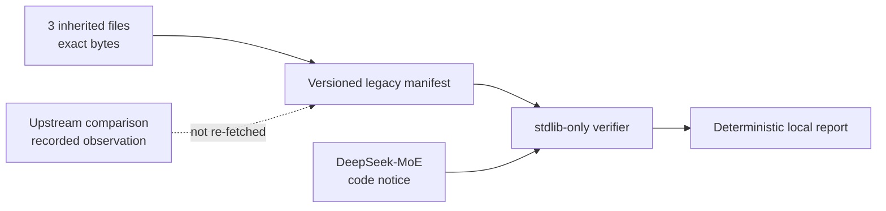

# LossTopology Lab

> **Rehabilitation status:** provenance foundation only. The inherited trainer
> is quarantined, not a supported entry point. This repository does not yet
> claim a successful training run, model-quality result, or benchmark.

LossTopology Lab is being built as a CPU-runnable audit system for supervised
fine-tuning token boundaries and assistant-only loss masks. Its first task is
more fundamental: establish an honest, testable boundary around the repository
that existed before the new system.



## What exists today

| Area | Current state | Evidence |
|---|---|---|
| Legacy bytes | 3 files locked by mode, size, SHA-256, line count, and Git blob ID | `provenance/legacy-snapshot.v1.json` |
| Local semantic check | ZeRO-3 JSON normalized and re-hashed without third-party packages | `tools/verify_legacy_snapshot.py` |
| Attribution | DeepSeek-MoE credited; upstream MIT code notice retained locally | `THIRD_PARTY_NOTICES.md` |
| Drift tests | Byte changes, formatting-only changes, duplicate JSON keys, symlinks, and notice drift fail closed | `tests/test_legacy_attestation.py` |
| Models and data | Not downloaded, vendored, loaded, or attested | Explicit trust boundary |
| LossTopology engine | Not implemented in this foundation slice | No capability claim |

The inherited files remain at their historical paths so this first change does
not rewrite their bytes or obscure repository history:

- `finetune.py`
- `configs/ds_config_zero3.json`
- `requirements.txt`

They are retained for provenance inspection only. Tests and verification never
import or execute `finetune.py`.

## Verify the snapshot

The complete verification path uses only the Python standard library:

```bash
python3 tools/verify_legacy_snapshot.py
python3 tools/verify_legacy_snapshot.py --json
python3 -m unittest discover -s tests -v
```

The verifier reads a bounded, strict JSON manifest; rejects duplicate keys,
unsafe paths, symlinks, missing files, and schema ambiguity; checks every
legacy byte identity; verifies the local third-party notice; and recomputes the
local semantic hash. It performs no network access and imports no ML stack.

## Provenance and license boundary

A review found that 185 of the 230 local trainer lines participate in an exact
line longest-common-subsequence comparison with the official
[DeepSeek-MoE `finetune.py`](https://github.com/deepseek-ai/DeepSeek-MoE/blob/66edeee5a4f75cbd76e0316229ad101805a90e01/finetune/finetune.py).
The local ZeRO-3 configuration and the corresponding upstream configuration
produced the same sorted, compact semantic JSON SHA-256:
`ac305ab8aba093eb0a29f94629baf3c89ca266077f1246ae89a42b3648aaf23e`.

Those are recorded cross-repository audit observations against immutable
upstream revision
[`66edeee5`](https://github.com/deepseek-ai/DeepSeek-MoE/tree/66edeee5a4f75cbd76e0316229ad101805a90e01).
The manifest pins the exact upstream Git blob IDs and byte lengths. The
upstream bytes are not copied into the attestation fixture, so the offline
verifier does not claim to rerun that comparison; it proves the local files
are still the files that were compared.

DeepSeek-MoE publishes its code under its
[MIT `LICENSE-CODE`](https://github.com/deepseek-ai/DeepSeek-MoE/blob/66edeee5a4f75cbd76e0316229ad101805a90e01/LICENSE-CODE).
The retained notice is scoped to inherited DeepSeek-derived code. There is no
repository-wide license declaration in this foundation slice.

Code terms do not grant model or dataset rights. A future adapter must
separately pin and document every model, tokenizer, dataset, checkpoint,
revision, checksum, and applicable license before it can enter a reproducible
workflow.

## Planned original system

New work will live outside the inherited trainer and will be tested against
small synthetic conversations:

1. a strict, bounded, versioned conversation and token-trace contract;
2. whole-example tokenization with explicit role spans and assistant-only loss
   topology;
3. differential checks for separately-tokenized prefix-boundary drift;
4. truncation, zero-target, padding, special-token, duplicate, and split-leak
   diagnostics;
5. deterministic risk certificates, counterexample traces, and reproducible
   visual evidence.

Until those pieces land with tests and real evidence, they are a roadmap—not
features.
