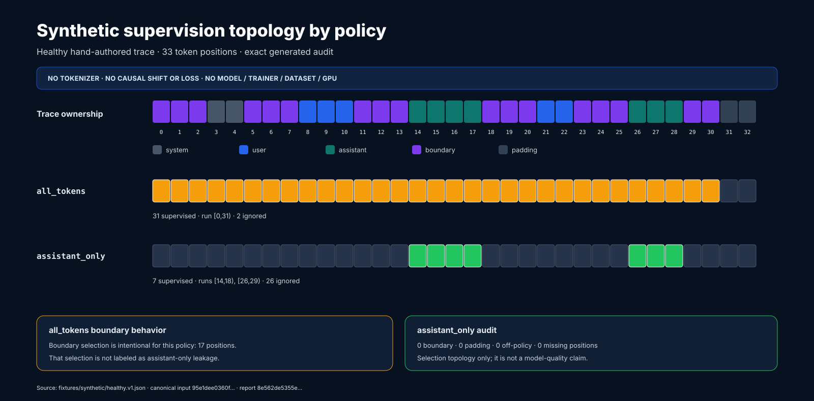
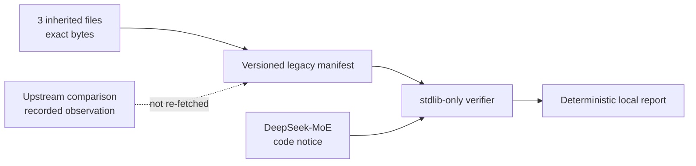
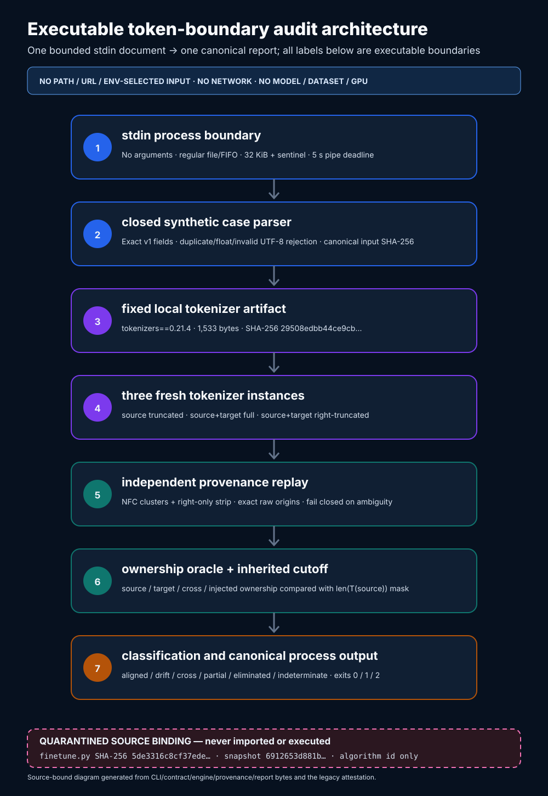
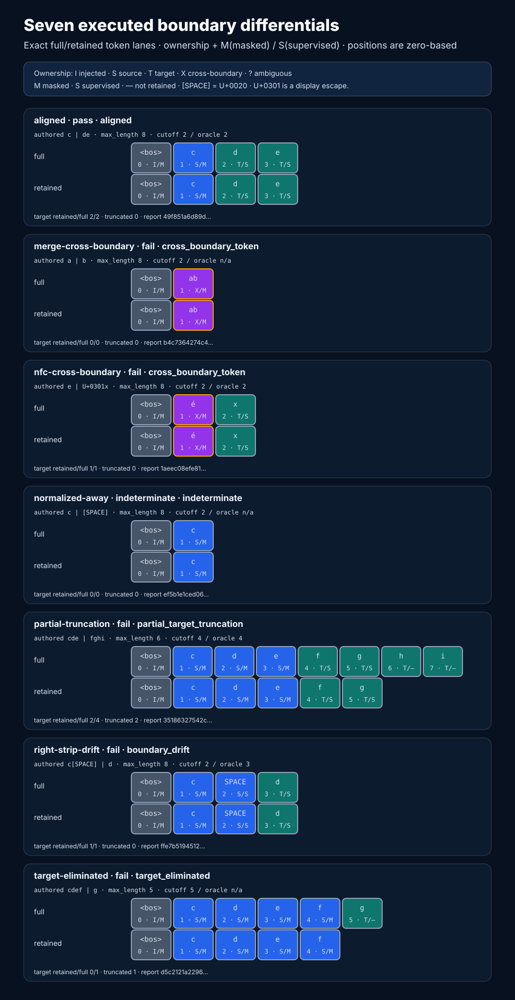
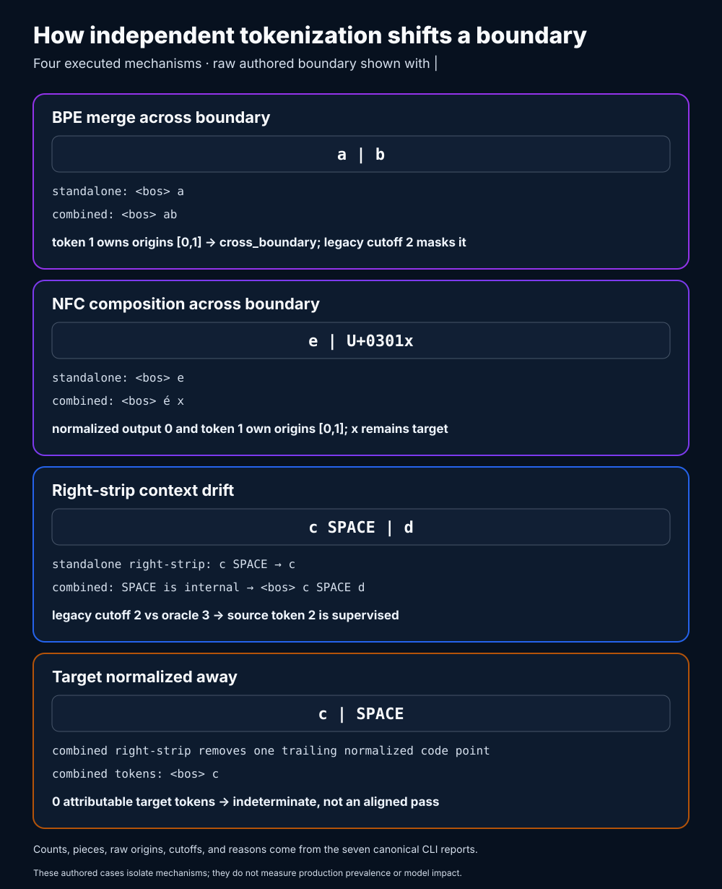
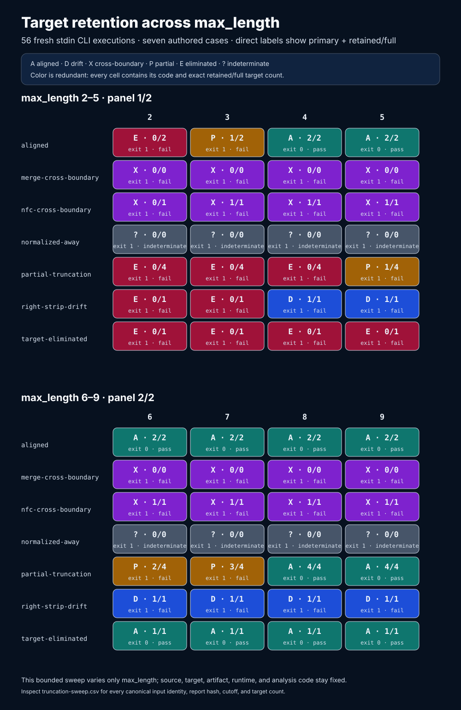
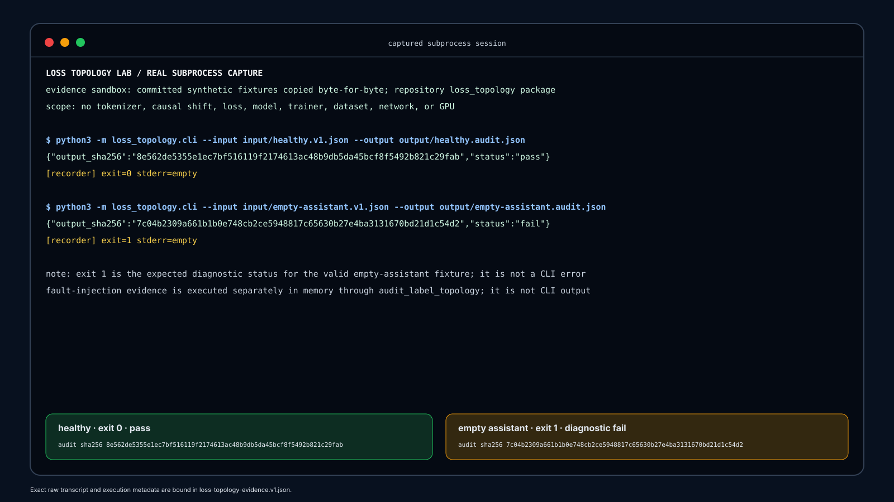
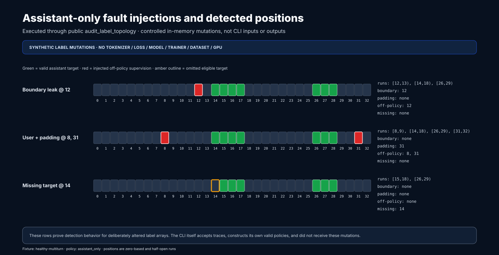
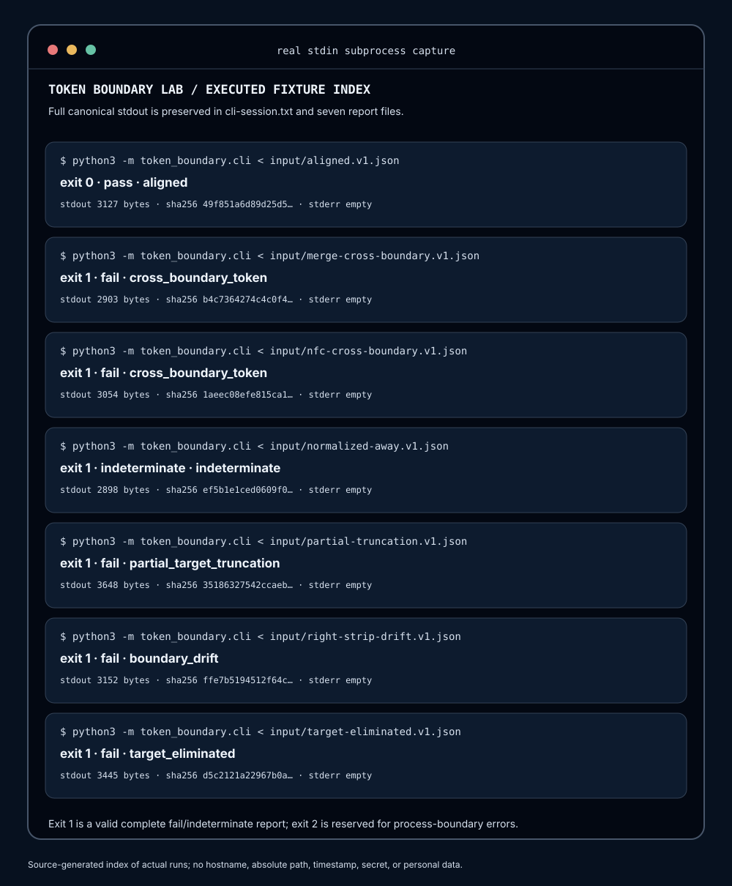

# LossTopology Lab

> **Rehabilitation status:** provenance-bound, CPU-runnable loss-topology and
> tokenizer-boundary audit lab. The inherited trainer remains quarantined and
> is not a supported entry point. This repository makes no claim about a
> DeepSeek or pretrained tokenizer/model, dataset, training run, model quality,
> perplexity, benchmark, or real-world prevalence.

LossTopology Lab audits two adjacent SFT failure surfaces: assistant-only loss
mask topology over authored traces, and drift between independently tokenized
`source` and `source + target`. The inherited trainer remains byte-attested at
its historical path; new audit paths neither import nor execute it.





## What exists today

| Area | Current state | Evidence |
|---|---|---|
| Legacy bytes | 3 files locked by mode, size, SHA-256, line count, and Git blob ID | `provenance/legacy-snapshot.v1.json` |
| Local semantic check | ZeRO-3 JSON normalized and re-hashed without third-party packages | `tools/verify_legacy_snapshot.py` |
| Attribution | DeepSeek-MoE credited; upstream MIT code notice retained locally | `THIRD_PARTY_NOTICES.md` |
| Drift tests | Byte changes, formatting-only changes, duplicate JSON keys, symlinks, and notice drift fail closed | `tests/test_legacy_attestation.py` |
| Synthetic trace contract | Strict v1 conversations, explicit token spans, immutable models, canonical identities | `docs/synthetic-trace-contract.md` |
| Loss topology engine | Deterministic all-token and assistant-only label construction plus boundary/run audits | `docs/loss-topology-audit.md` |
| Loss-topology CLI | Bounded stdlib input, atomic file publication, and canonical reports | `python3 -m loss_topology.cli --help` |
| Loss-topology evidence | Two real CLI runs, three public-API fault injections, three SVGs, exact reports, and a source/artifact manifest | `docs/reproducible-evidence.md` |
| Local tokenizer artifact | Locally authored 15-entry BPE artifact, hash-pinned with NFC, right-only strip, prefix BOS, and `tokenizers==0.21.4` | `docs/token-boundary/contract.md` |
| Token-boundary differential | Three fresh encodings, normalization provenance replay, ownership oracle, legacy cutoff comparison, and deterministic classification | `docs/token-boundary/methodology.md` |
| Token-boundary CLI | No-argument stdin interface with bounded reads, redacted failures, and canonical stdout | `token-boundary-audit` |
| Token-boundary evidence | Seven executed reports, 56 truncation runs, five source-generated SVGs, a full transcript, and a checksum manifest | `docs/token-boundary/evidence.md` |
| External artifacts | No pretrained model, DeepSeek tokenizer, or dataset is downloaded, loaded, or attested; only the local synthetic tokenizer artifact is permitted | Explicit trust boundary |

The inherited files remain at their historical paths. Rehabilitation work
keeps those bytes unchanged and does not obscure their repository history:

- `finetune.py`
- `configs/ds_config_zero3.json`
- `requirements.txt`

They are retained for provenance inspection only. Tests and verification never
import or execute `finetune.py`.

## Verify the snapshot

The legacy attestation and loss-topology baseline use only the Python standard
library. Runtime-dependent tokenizer tests require the separately pinned
optional dependency; without it, those cases fail closed or are explicitly
skipped rather than silently changing behavior.

```bash
python3 tools/verify_legacy_snapshot.py
python3 tools/verify_legacy_snapshot.py --json
python3 -m unittest discover -s tests -v
```

The verifier reads a bounded, strict JSON manifest; rejects duplicate keys,
unsafe paths, symlinks, missing files, and schema ambiguity; checks every
legacy byte identity; verifies the local third-party notice; and recomputes the
local semantic hash. It performs no network access and imports no ML stack.

## Set up the optional tokenizer lab

The provenance verifier and loss-topology path need no ML packages. The
token-boundary differential uses one exact optional runtime:

```bash
python3 -m venv .venv
.venv/bin/python -m pip install -e '.[tokenizer-lab]'
.venv/bin/python -c 'import tokenizers; print(tokenizers.__version__)'
```

Provisioning may contact a package index. Once installed, the documented run
reads its stdin case and the hash-pinned local artifact; it does not make a
network request or download a model, pretrained tokenizer, or dataset.

## Audit a synthetic topology

The checked fixtures contain synthetic text and hand-authored token IDs. The
lab does not claim a real tokenizer produced them.

```bash
mkdir -p build
python3 -m loss_topology.cli \
  --input fixtures/synthetic/healthy.v1.json \
  --output build/healthy.audit.json
python3 -m json.tool build/healthy.audit.json
```

The output binds the validated input by canonical SHA-256, shows exact label
arrays and supervised runs for both policies, and counts boundary, padding,
off-policy, and missing-target positions. The deliberately empty assistant
fixture returns status 1 with a canonical failing report:

```bash
python3 -m loss_topology.cli \
  --input fixtures/synthetic/empty-assistant.v1.json \
  --output build/empty-assistant.audit.json
```

Contract violations return status 2 and do not replace an existing output.
See `docs/synthetic-trace-contract.md` and `docs/loss-topology-audit.md` for the
limits and exact trust boundary.

## Audit a tokenizer boundary

The inherited heuristic computes `len(T(source))` independently and uses that
number as the mask cutoff over `T(source + target)`. This lab executes that
length-based decision against a locally authored tokenizer and compares it
with ownership reconstructed from token pieces, offsets, normalization
provenance, and the untruncated encoding.



The CLI intentionally accepts no arguments—not even paths, URLs, artifact
identifiers, or `--help`. One case enters through standard input:

```bash
mkdir -p build/token-boundary
.venv/bin/token-boundary-audit \
  < fixtures/token-boundary/aligned.v1.json \
  > build/token-boundary/aligned.boundary-report.json
python3 -m json.tool \
  build/token-boundary/aligned.boundary-report.json
```

The aligned case returns `0`. Running the same command with
`merge-cross-boundary.v1.json` returns `1` and still writes a complete canonical
report: the executed BPE runtime forms one `ab` token from material on both
sides of `a|b`.

| Exit | Meaning | Output |
|---:|---|---|
| `0` | Valid aligned result | Canonical report on stdout; empty stderr |
| `1` | Valid fail or indeterminate result | Canonical report on stdout; empty stderr |
| `2` | Input, runtime, report, interruption, or process-boundary error | Canonical redacted error on stderr |

Pre-output failures do not begin a report. A downstream transport failure can
still leave partial stdout when a report exceeds the operating system's atomic
pipe-write limit; the exact behavior is documented in the
[token-boundary contract](docs/token-boundary/contract.md).



These seven cases are authored counterexamples, not sampled observations or a
benchmark.

### How independent tokenization shifts a boundary

The assumption under test is:

```text
T(source + target)[:len(T(source))] == T(source)
```

The executed cases isolate cross-boundary BPE merging, NFC composition across
the authored boundary, context-sensitive right stripping, and a target removed
entirely by normalization. The view is reconstructed from canonical reports,
not manually invented token sequences.



### Truncation is a boundary decision

The bounded sweep varies `max_length` from 2 through 9 for all seven authored
text configurations. Every one of the 56 cells is a fresh stdin CLI execution
and contains its direct classification plus exact retained/full target count.



For the `partial-truncation` text, target retention moves from `0/4` at lengths
2–4 through `1/4`, `2/4`, and `3/4`, reaching `4/4` at length 8. For the
`target-eliminated` text, retention is `0/1` through length 5 and `1/1` from
length 6. Those are deterministic results for this authored grid only; they do
not estimate production frequency, severity, or model impact.

## Reproducible evidence

### Loss-topology evidence

The evidence generator is hardcoded to the two committed synthetic fixtures.
It invokes the public CLI twice in a repository-local ephemeral sandbox and
captures the actual stdout, stderr state, exit code, and canonical reports.
The empty-assistant fixture's exit status 1 is an expected diagnostic result,
not a CLI or contract error.



The fault view is a different execution boundary. It deliberately changes
three in-memory `assistant_only` label arrays and passes them to the public
`audit_label_topology` API. Those mutations are not CLI inputs or outputs.



Regenerate or verify every loss-topology evidence byte with the Python
standard library:

```bash
PYTHONDONTWRITEBYTECODE=1 \
  python3 tools/render_loss_topology_evidence.py --write
PYTHONDONTWRITEBYTECODE=1 \
  python3 tools/render_loss_topology_evidence.py --check
```

`--check` reruns both CLI cases, reconstructs all visuals and the manifest, and
requires byte-for-byte agreement. Publication stages the complete bundle,
rolls back if any artifact fails, and replaces the
[manifest](docs/evidence/generated/loss-topology-evidence.v1.json) last.
The canonical [healthy report](docs/evidence/generated/healthy.audit.json),
[empty-target report](docs/evidence/generated/empty-assistant.audit.json), and
[raw CLI transcript](docs/evidence/generated/cli-session.txt) remain directly
inspectable. See [the evidence contract](docs/reproducible-evidence.md) for the
source allowlist and claim boundary.

### Token-boundary evidence

The token-boundary generator invokes the public stdin CLI for all seven
committed fixtures and for every truncation-sweep cell. It captures real exit
status, stdout and stderr state, canonical report bytes, runtime identity,
source hashes, and artifact hashes.



```bash
PYTHONDONTWRITEBYTECODE=1 \
  .venv/bin/python tools/render_token_boundary_evidence.py --write
PYTHONDONTWRITEBYTECODE=1 \
  .venv/bin/python tools/render_token_boundary_evidence.py --check
```

The [full CLI transcript](docs/token-boundary/generated/cli-session.txt), seven
canonical reports
([aligned](docs/token-boundary/generated/aligned.boundary-report.json),
[merge](docs/token-boundary/generated/merge-cross-boundary.boundary-report.json),
[NFC](docs/token-boundary/generated/nfc-cross-boundary.boundary-report.json),
[normalized-away](docs/token-boundary/generated/normalized-away.boundary-report.json),
[partial truncation](docs/token-boundary/generated/partial-truncation.boundary-report.json),
[right-strip drift](docs/token-boundary/generated/right-strip-drift.boundary-report.json),
and [target eliminated](docs/token-boundary/generated/target-eliminated.boundary-report.json)),
[truncation CSV](docs/token-boundary/generated/truncation-sweep.csv), and
[evidence manifest](docs/token-boundary/generated/token-boundary-evidence.v1.json)
remain directly inspectable. See the
[token-boundary evidence contract](docs/token-boundary/evidence.md) for the
source allowlist, deterministic publication rules, and claim boundary.

## Provenance and license boundary

A review found that 185 of the 230 local trainer lines participate in an exact
line longest-common-subsequence comparison with the official
[DeepSeek-MoE `finetune.py`](https://github.com/deepseek-ai/DeepSeek-MoE/blob/66edeee5a4f75cbd76e0316229ad101805a90e01/finetune/finetune.py).
The local ZeRO-3 configuration and the corresponding upstream configuration
produced the same sorted, compact semantic JSON SHA-256. The full identity is
recorded in the [legacy manifest](provenance/legacy-snapshot.v1.json); its
prefix is `ac305ab8aba0…`.

Those are recorded cross-repository audit observations against immutable
upstream revision
[`66edeee5`](https://github.com/deepseek-ai/DeepSeek-MoE/tree/66edeee5a4f75cbd76e0316229ad101805a90e01).
The manifest pins the exact upstream Git blob IDs and byte lengths. The
upstream bytes are not copied into the attestation fixture, so the offline
verifier does not claim to rerun that comparison; it proves the local files
are still the files that were compared.

DeepSeek-MoE publishes its code under its
[MIT `LICENSE-CODE`](https://github.com/deepseek-ai/DeepSeek-MoE/blob/66edeee5a4f75cbd76e0316229ad101805a90e01/LICENSE-CODE).
The retained notice is scoped to inherited DeepSeek-derived code. There is no
repository-wide license declaration.

Code terms do not grant model or dataset rights. Any future adapter that
introduces an external model, tokenizer, dataset, or checkpoint must separately
pin its revision, checksum, provenance, and applicable license before entering
a reproducible workflow.

## Scope and next work

All rehabilitation code lives outside the inherited trainer. The provenance
and loss-topology baseline remains standard-library-only. The tokenizer path is
a separate opt-in capability pinned to `tokenizers==0.21.4` and one
hash-verified, locally authored synthetic artifact.

The positive claim is narrow but executable: the lab reproduces the attested
standalone-source token-count cutoff and demonstrates BPE merge, NFC,
right-strip, and truncation counterexamples with canonical reports. It does not
claim a DeepSeek or pretrained tokenizer result, production prevalence,
training impact, model quality, or a universally correct masking policy.

Dataset split-leak analysis, risk certificates, externally licensed
model-bound evaluation, and measured production prevalence remain future work.
They are not current capability claims.
